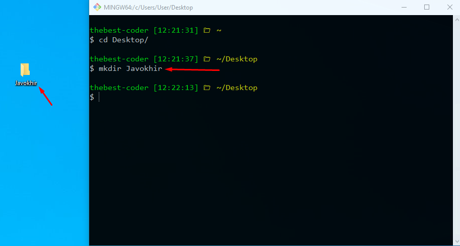

# tguserinfo-bot
Telegram: @tguserinforobot

⚡️Step-1 <b>Birinchi o'rinda Git yoki terminal orqali <code>cd Desktop</code> buyrug'i orqali Desktopga o'tib olamiz
Screenshoot👇</b>

⚡️Step-1 <b>First of all, I need to download the code from the github repository</b>

<code> git clone https://github.com/thebest-coder/tguserinfo-bot.git </code>

⚡️Step-2

<code> cd tguserinfo-bot </code>

⚡️Step-3

<code> pip install requirements.txt </code>

⚡️Step-4

<code> config.py file | Change API_TOKEN = "BOT_TOKEN" <- You bot token </code>

⚡️Step-5

<code> python bot.py </code>

# 🔥successful ✅ 
<h1>Now you have this bot too🥳</h1>
