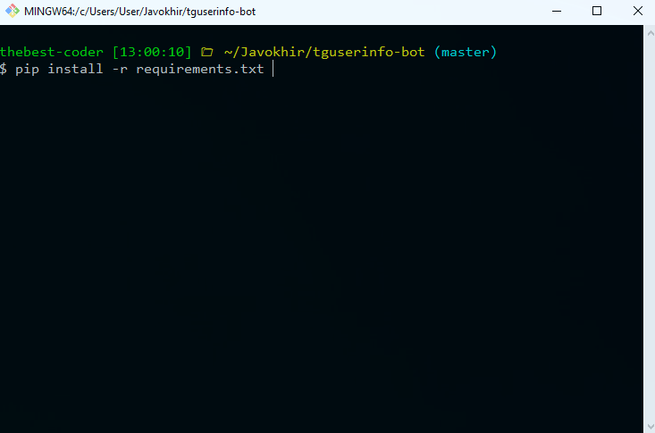
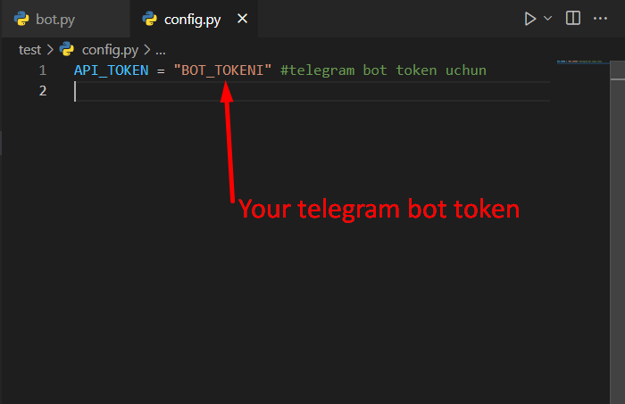
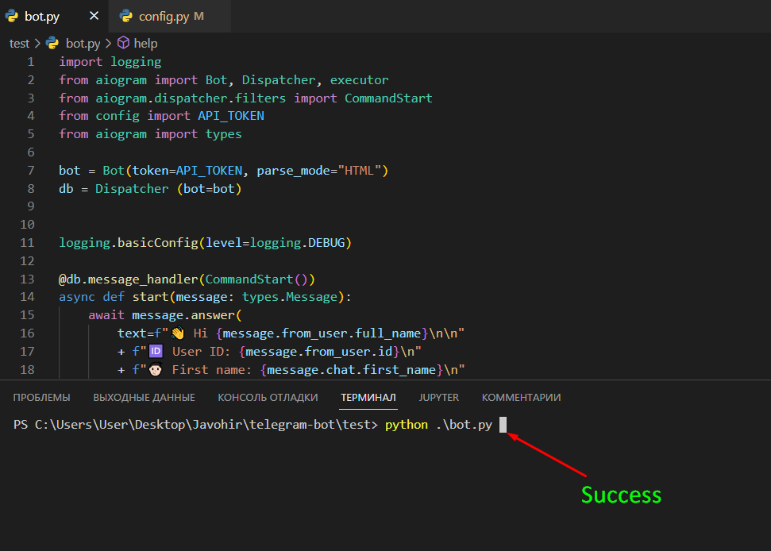

# tguserinfo-bot
Telegram: @tguserinforobot

<b>⚡️Step-1.</b> Birinchi o'rinda Git yoki Terminal orqali <code>cd Desktop</code> buyrug'i orqali Desktopga o'tib olamiz va <code>mkdir papka_nomi</code> buyrug'i orqali projectimiz uchun 1 ta yangi papka yaratib ham olamiz
Screenshoot👇

  

<b>⚡️Step-2.</b> O'sha yaratgan papkamiz ichiga kirib olishimiz kerak bu esa <code>cd papka_nomi</code> buyrug'i orqali

 

<b>⚡️Step-3.</b> Endi esa mani Github accountimga kirib repo`ni yuklab olish uchun link olamiz

Link mana shu 👇 yoki screenshootga qarab qayerdan olishni ko'rsangiz ham bo'ladi.

<code> git clone https://github.com/thebest-coder/tguserinfo-bot.git </code>  

 Yana bir bor teppadagi buyruqdan foydalangan holda yani <code>cd tguserinfo-bot</code> project papkamizga kiramiz
 
 

<b>⚡️Step-4.</b> <code> pip install -r requirements.txt</code> buyruqdan foydalanib kerakli package`larni yuklab olamiz. (screenshoot👇)

 

⚡️Step-5. Birorta code editor orqali kodlarni ochib olib, <b>config.py</b> filega kirib <b>API_TOKEN</b> ni o'zgartiramiz o'zimizni bot tokenimizga

 

⚡️Step-6. GitBash orqali yokida birorta editor orqali <code>bot.py</code> dasturimizni ishga tushiramiz va shu bilan bo'ldi🥵🥳

<code> python bot.py </code>  
 

# 🔥successful ✅ 
<h1>Now you have this bot too🥳</h1>
